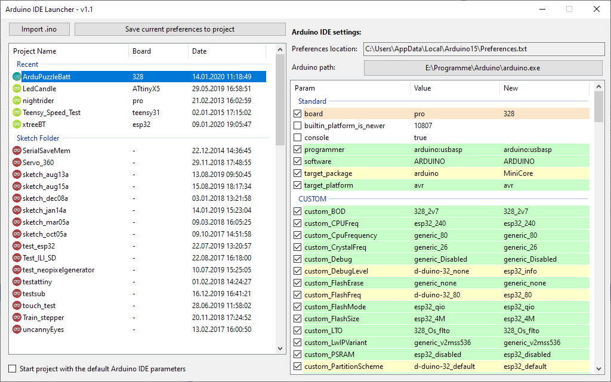

# Arduino IDE Launcher  
 
 This tool will launch the Arduino IDE with your custom board.
 
 Tired to change manually the board every time you launch your Arduino IDE?
 
 Now, you can set your preferences directly in your sketch or save the current preferences in your sketch folder.
 
 ## Start application
 It is a .net core 3 application. You need the runtimes to start it (Windows, Linux or MacOS). You can download it directly from the Microsoft page:
 https://dotnet.microsoft.com/download/dotnet-core/3.0
 - If you want compile this project, you need to download the SDK for Visual Studio.
 
 ## Application interface
 The Preferences text file is detected automatically. The location of your Arduino.exe file must be set by you, before you can use the application.
 
 On the left side, you have your sketches and you can also import/open sketches from other folders.  
 On the right side, you see the current preferences with your custom values:
 - grey: unused preferences
 - green: preference ist the same as the default
 - yellow: you saved a custom preference inside a file (this is in your sketch folder)
 - orange: you set custom preference inside the ino sketch

## How to save your custom preferences
### Method 1  
- Open your Arduino IDE normally (or over this application).
- Set your board and edit your preferences
- Close your Arduino IDE, so the preferences are saved in the file
- Now, select a sketch
- Check/select the preferences you want to save in your custom file
- Press "Save current preferendes to project" to create a `.preferences.txt` file inside your sketch folder.
### Method 2  
- Open your sketch in the Arduino IDE
- Write your custom paramenter in your main `*.ino` file with this format: 
- `**#ide_param:PARAM_NAME=PARAM_VALUE`
- Example:
```
/* Arduino IDE Parameters:
**#ide_param:board=328
*/
```


## How Arduino IDE is started
If your sketch has some custom preferences, you will see a yellow (preferences.txt) or green (preferences inside your sketch) icon.

Once you double click your sketch, a new preferences file will be generated inside the temporary folder. The default preferences will be merged with your custom preferences for this project.
